# Photon
## Studente
Nicholas Kania
#326850

## Scopo dell'applicazione
Lo scopo dell'applicazione consiste nel creare un applicativo software che permetta il backup su un server delle foto presenti all'interno del dispositivo.

## Casi d'Uso
I casi d'uso per l'utilizzo dell'applicativo possono essere racchiusi in due categorie:
- Caricamento di immagini;
- Registro dei caricamenti.

## UX
Vi sono dei passaggi comuni ad entrambe le funzionalità offerte dell'applicazione:

### Comuni
L'utente scannerizza il codice QR mostrato dall'istanza di [photon-server](https://github.com/GeckoNickDeveloper/photon-server). Dopodiché verrà effettuato un tentativo di autenticazione: se il QR è valido e sia il client che il server si trovano all'interno della stessa rete, il dispositivo verrà autenticato.

Una volta effettuata l'autenticazione, comparirà all'interno della AppBar una voce per il logout ed all'utente verrà mostrata una pagina contenente un pulsante per tornare all'interno della Home.

Se autenticati, essa mostrerà le due funzionalità dell'applicazione: caricamento dei file e registro dei caricamenti presso quel server.

### Caricamento
Una volta premuto il pulsante all'interno della Home, l'applicazione chiederà il permesso di accesso al file system all'utente.
Se egli decide di rifiutare, verrà mostrata una SnackBar che specifica che è obbligatorio per l'utilizzo della funzionalità.

Una volta garantiti i permessi, verranno lette le varie immagini dal dispositivo (directory: `/storage/emulated/0`) e successivamente mostrate a schermo (nome file e percorso). In fondo alla pagina apparirà una pulsante che permette di caricare le immagini (se non vi è un caricamento in corso e non sono state tutte caricate), interrompere un caricamento e, una volta completati tutti i caricamenti, di tornare indietro alla Home.

> Attualmente, le immagini vengono lette solo all'interno della cartella 'DCIM' e solo i file `.jpg`.

### Registro dei caricamenti
Una volta premuto il pulsante all'interno della Home, l'applicazione invierà una richiesta al server per ricevere la lista delle immagini caricate, munite di data di caricamento.

Questa pagina richiede semplicemente i dati dei caricamenti e li mostra a schermo. 

## UI
### Home
#### Non Autenticato
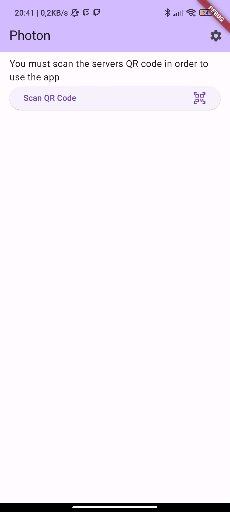

#### Autenticato
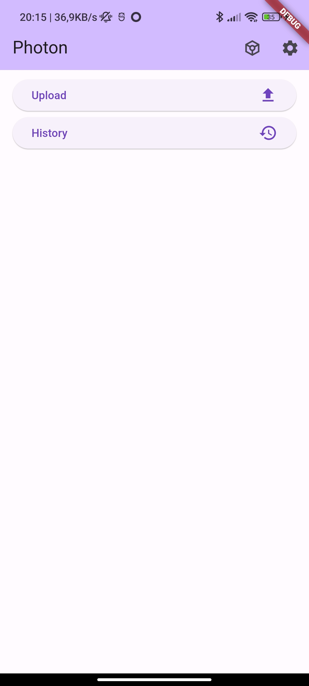

### Auth
#### Scan Error
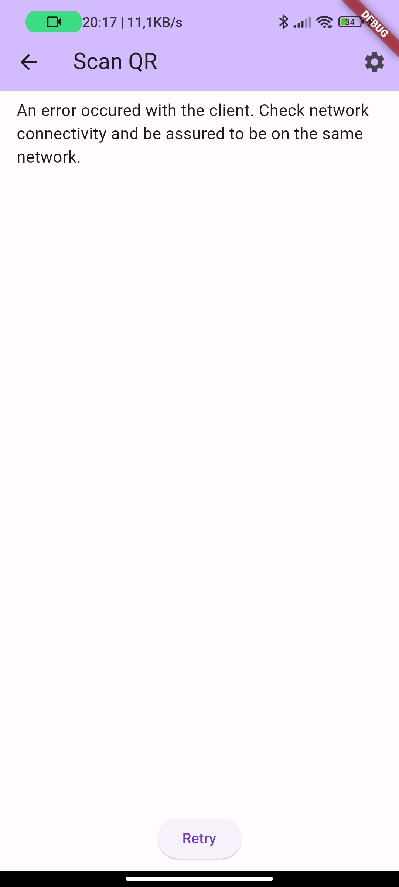

### Upload
#### Upload Finito
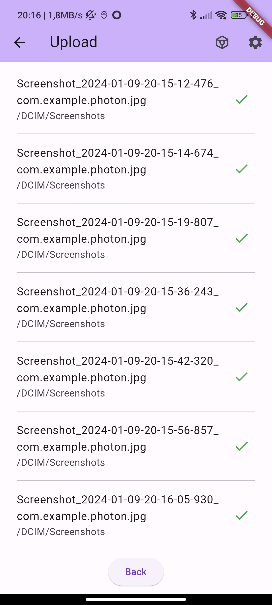
#### Errore in upload
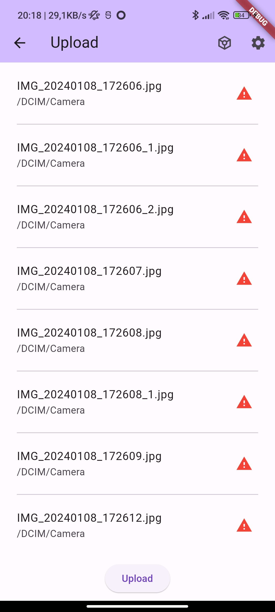
#### Upload annullato
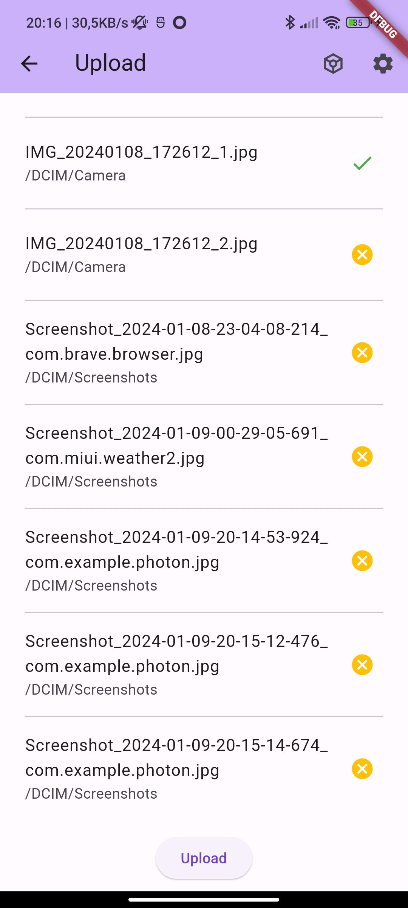
#### Upload in corso
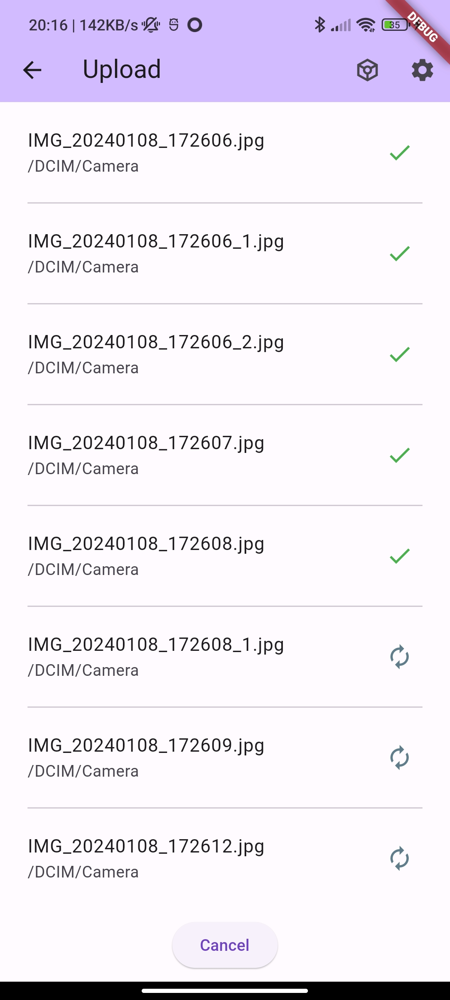
#### Lista file
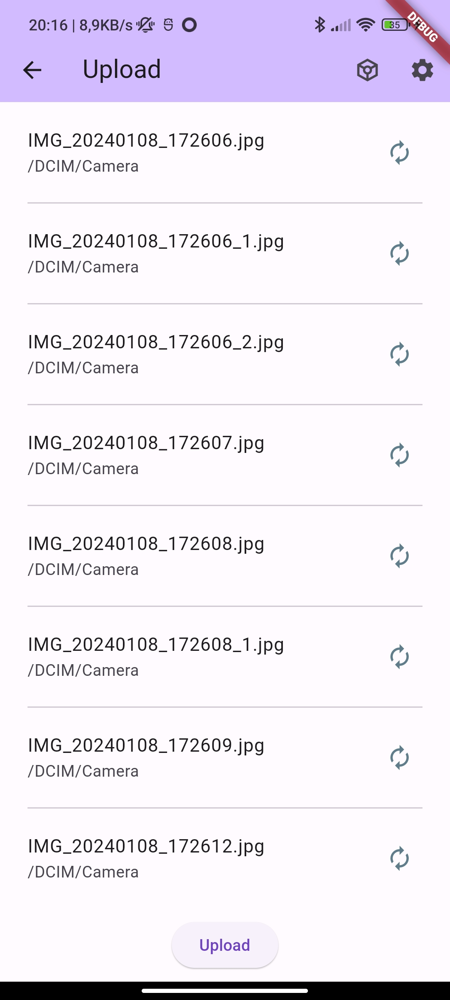

## History
#### Errore di comunicazione
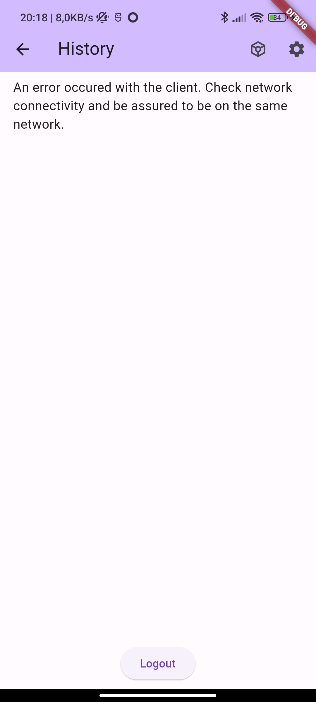
#### Lista
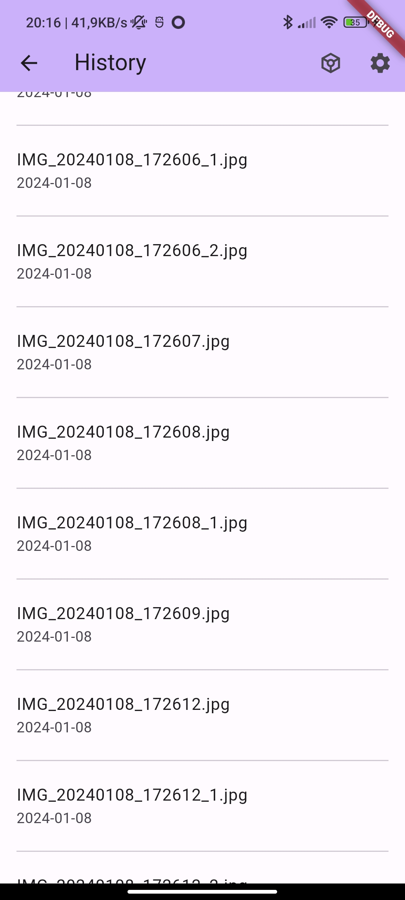

## Settings
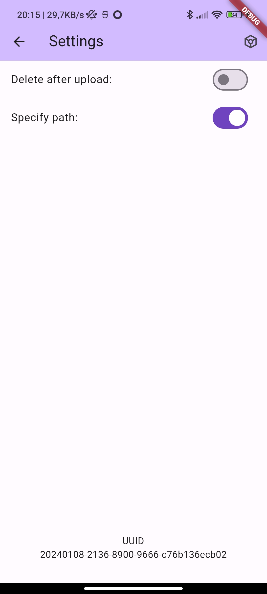

## Tecnologie Utilizzate
Per la gestione dello stato, fulcro nevralgico di `flutter`, si è optato per l'utilizzo della libreria `flutter_riverpod`. Tramite essa è stato possibile gestire i cambiamenti dei dati durante l'interazione con l'applicazione.
Per la gestione del filesystem e dei permessi, invece, sono state utilizzate le librerie `shared_preferences` e `permission_handler`.

Uno dei punti focali dell'applicazione è l'operazione di autenticazione presso il server. Essendo essa basata sulla scansione di un codice QR, si è reso necessario l'utilizzo della libreria `qr_code_scanner`. Dato che questo progetto si basa fortemente sulle comunicazione di rete, l'utilizzo della libreria `http` risulta intuitivo. Infine, al fine di poter assegnare un identificativo al dispositivo sul quale è presente l'applicazione, è stata scelta la libreria `uuid`.

### Dipendenze
- flutter_riverpod: ^2.4.8
- shared_preferences: ^2.2.2
- permission_handler: ^11.0.1
- uuid: ^4.2.1
- qr_code_scanner: ^1.0.1
- http: 1.1.0

## Gestione dello stato
Come detto in precedenza, la gestione dello stato è il punto nevralgico di ogni applicazione Flutter. In questa sezione verranno spiegate le varie scelte per la gestione di quest'ultimo.

Innanzitutto, è stato creato un provider globale che dica banalmente se il dispositivo è autenticato. Esso viene modificato dai pulsanti di logout ed dall'esito della registrazione presso il server. Al cambio di questo valore, le pagine tornano automaticamente alla Home. Ciò rende necessario autenticarsi nuovamente.

La pagina `Home`, a seconda del fatto che il dispositivo è autenticato o no, mostra a schermo due schermate:
- non autenticato:
	- pulsante per la navigazione alla pagina `Auth`;
- autenticato:
	- pulsante per effettuare un caricamento;
	- pulsante per ottenere il registro dei caricamenti.

Per quanto riguarda la pagina `Auth` di autenticazione, sono presenti due provider:
- il primo è un semplice booleano che determina se la pagina sta scansionando o elaborando la registrazione;
- il secondo gestisce effettivamente lo stato della registrazione tramite una chiamata HTTP.
È inoltre presente un "mutex" artificiale permetta di elaborare solo un QR alla volta. Esso è implementato tramite un semplice singleton.

La pagina `History` contiene anch'esso due provider: uno per effettuare la comunicazione di rete e uno per contenere lista dei caricamenti.

La pagina più ostica è quella di `Upload`. Essa non solo deve effettuare un caricamento dei dati, ma anche la modifica di essi elemento per elemento. Si è reso dunque necessario l'utilizzo di uno state notifier personalizzato per poter rappresentare la lista di immagini da caricare e di un family provider per poter accedere al singolo elemento. Inoltre è presente un futur provider che elabora la lista di tutti i file possibili da caricare e che aggiorni la lista mostrata a schermo. La gestione della cancellazione e ripresa del caricamento viene gestita tramite i campi del notifier personalizzato.